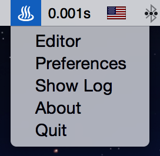

# DailyNote

### What

>  DailyNote is a tiny tool for OS X user who like writing daily note to save note data to beautiful & uniform markdown files with git commit history.

### Why

> Why DailyNote? Why not open my markdown editor, write note, save it, do a commit, push to remote (maybe) ? I just keep all the things together, I prefer that.

### How

> 1. Specify a special git repository path in Preferences window at the first running time.
> 2. Write note in editor window, one record in one line.
> 3. Post it!

### When

> 1. When to write note changes to file? ~~It’s 23:59:59 everyday~~. It's up to you, open Preferences window, just give it your after work time.
> 2. When to do commits to git repository? Same as above.
> 3. A reminder there? Yes, this is a new feature after version 1.0.4, just make sure the reminder option in Preferences checked. It will remind you to write daily note before 5 minutes when committing every day.
> 4. When to push commit to remote git repository? Not yet. Implementation is coming soon!

---

### Screen shot

Menu

 

Editor

Preferences 

Preview markdown file in Mou

Enjoy!